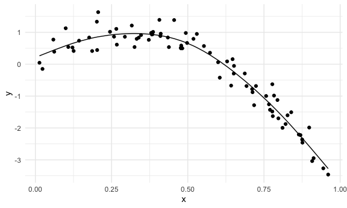
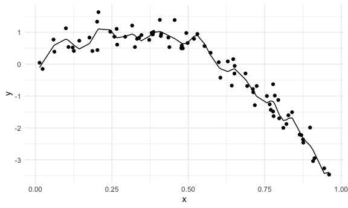
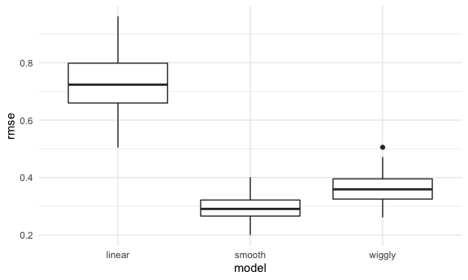
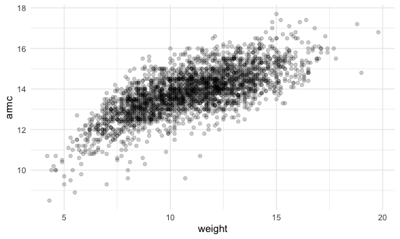
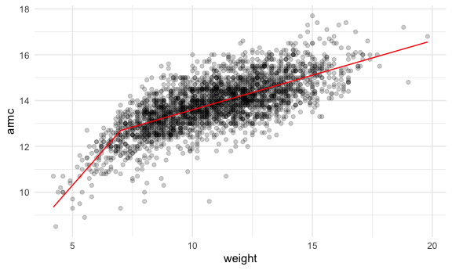
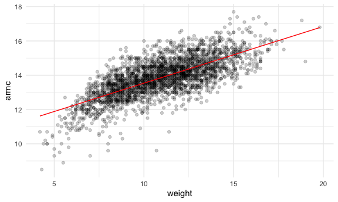
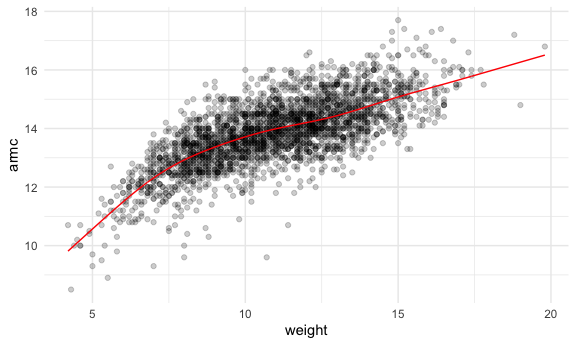

cross validation
================

``` r
library(tidyverse)
```

    ## ── Attaching packages ─────────────────────────────────────── tidyverse 1.3.1 ──

    ## ✓ ggplot2 3.3.5     ✓ purrr   0.3.4
    ## ✓ tibble  3.1.5     ✓ dplyr   1.0.7
    ## ✓ tidyr   1.1.3     ✓ stringr 1.4.0
    ## ✓ readr   2.0.1     ✓ forcats 0.5.1

    ## ── Conflicts ────────────────────────────────────────── tidyverse_conflicts() ──
    ## x dplyr::filter() masks stats::filter()
    ## x dplyr::lag()    masks stats::lag()

``` r
library(modelr)
library(mgcv)
```

    ## Loading required package: nlme

    ## 
    ## Attaching package: 'nlme'

    ## The following object is masked from 'package:dplyr':
    ## 
    ##     collapse

    ## This is mgcv 1.8-38. For overview type 'help("mgcv-package")'.

``` r
knitr::opts_chunk$set(
  fig.width = 6,
  fig.asp = .6,
  out.width = "90%"
)

theme_set(theme_minimal() + theme(legend.position = "bottom"))

options(
  ggplot2.continuous.colour = "viridis",
  ggplot2.continuous.fill = "viridis"
)

scale_colour_discrete = scale_colour_viridis_d
scale_fill_discrete = scale_fill_viridis_d
```

Fitting non-linear models - take his word for it

Model selection is hard - you have competing goals: 1) fit your current
dataset well 2) AIC/ BIC make you pay a price for too much complexity

If I’ve done a good job building my model on my first dataset, it should
do a good job predicting a second dataset (cross-validation)

Prediction accuracy - go into testing dataset, get fitted values based
on my previous model, if i make good predictions, I’ll have a small root
mean squared error. We want small RMSE

Typically you repeat the process MANY times

Typically just does an 80/20 split and then do it 100 times and look at
RMSE look like in each of those cases

Can also compare models via cross validation or AIC/ BIC

Prediction as a goal: you want to do cross-validation AFTER you’ve
determined confounders, etc.

Tools for CV: add\_predictions add\_residuals rmse crossv\_mc

## Simulate a dataset

``` r
set.seed(1)

nonlin_df = 
  tibble(
    id = 1:100, 
    x = runif(100, 0, 1), 
    y = 1-10 * (x-0.3) ^2 + rnorm(100, 0, 0.3) 
  )

nonlin_df %>% 
  ggplot(aes(x = x, y = y)) +
  geom_point()
```


## Cross-validation by hand (Create splits by hand, plot, fit some models)

``` r
train_df = sample_n(nonlin_df, 80)

test_df = anti_join(nonlin_df, train_df, by = "id")

train_df %>% arrange(id)
```

    ## # A tibble: 80 × 3
    ##       id      x       y
    ##    <int>  <dbl>   <dbl>
    ##  1     1 0.266   1.11  
    ##  2     2 0.372   0.764 
    ##  3     3 0.573   0.358 
    ##  4     4 0.908  -3.04  
    ##  5     5 0.202   1.33  
    ##  6     6 0.898  -1.99  
    ##  7     7 0.945  -3.27  
    ##  8     9 0.629   0.0878
    ##  9    10 0.0618  0.392 
    ## 10    11 0.206   1.63  
    ## # … with 70 more rows

``` r
test_df %>% arrange(id)
```

    ## # A tibble: 20 × 3
    ##       id      x      y
    ##    <int>  <dbl>  <dbl>
    ##  1     8 0.661  -0.615
    ##  2    18 0.992  -3.35 
    ##  3    21 0.935  -2.89 
    ##  4    22 0.212   0.710
    ##  5    30 0.340   0.807
    ##  6    36 0.668  -0.258
    ##  7    46 0.789  -1.23 
    ##  8    49 0.732  -1.24 
    ##  9    52 0.861  -2.14 
    ## 10    55 0.0707  0.278
    ## 11    59 0.662  -0.195
    ## 12    63 0.459   1.18 
    ## 13    69 0.0842  0.683
    ## 14    74 0.334   0.935
    ## 15    75 0.476   0.659
    ## 16    76 0.892  -2.29 
    ## 17    78 0.390   0.908
    ## 18    83 0.400   1.06 
    ## 19    89 0.245   0.775
    ## 20    91 0.240   0.389

``` r
ggplot(train_df, aes(x = x, y = y)) + 
  geom_point() +
  geom_point(data = test_df, color = "red")
```


for cross validation to work, you have to have a real/ full split
between train and test dataset

## Fit my models with training dataset

``` r
linear_mod = lm(y ~ x, data = train_df)
smooth_mod = mgcv::gam( y ~ s(x), data = train_df)
wiggly_mod = mgcv::gam(y ~ s(x, k = 30), sp = 10e-6, data = train_df)
```

plot the results

``` r
train_df %>% 
  add_predictions(smooth_mod) %>% 
  ggplot(aes(x = x, y = y)) + 
  geom_point() +
  geom_line(aes(y = pred))
```



``` r
train_df %>% 
  add_predictions(wiggly_mod) %>% 
  ggplot(aes(x = x, y = y)) + 
  geom_point() +
  geom_line(aes(y = pred))
```



``` r
train_df %>% 
  add_predictions(linear_mod) %>% 
  ggplot(aes(x = x, y = y)) + 
  geom_point() +
  geom_line(aes(y = pred))
```


The second one - putting too much stuff in the model Third one - not
enough!

## Quantify the results

``` r
rmse(linear_mod, test_df)
```

    ## [1] 0.7052956

``` r
rmse(smooth_mod, test_df)
```

    ## [1] 0.2221774

``` r
rmse(wiggly_mod, test_df)
```

    ## [1] 0.289051

this function is going to take the linear model, given the coefficients
in the linear model, I’m going to take the predictions from the testing
df and find the rmse

This worked with one 80/20 split but maybe we try it again and again
with different 80/20 splits

## CV iteratively

Use `modelr::crossv_md`

``` r
cv_df = 
  crossv_mc(nonlin_df, 100)
```

Comes up with a dataset with a resample object -training dataset, then a
resample object - testing dataset, then the ID, and then we’ll add our
model outputs in following columns

``` r
cv_df %>% 
  pull(train) %>% 
  .[[1]] %>% 
  as_tibble()
```

    ## # A tibble: 79 × 3
    ##       id      x       y
    ##    <int>  <dbl>   <dbl>
    ##  1     1 0.266   1.11  
    ##  2     2 0.372   0.764 
    ##  3     3 0.573   0.358 
    ##  4     4 0.908  -3.04  
    ##  5     6 0.898  -1.99  
    ##  6     7 0.945  -3.27  
    ##  7     8 0.661  -0.615 
    ##  8     9 0.629   0.0878
    ##  9    10 0.0618  0.392 
    ## 10    11 0.206   1.63  
    ## # … with 69 more rows

We need to convert everything to a tible for mgcv to work

``` r
cv_df = 
  crossv_mc(nonlin_df, 100) %>% 
  mutate(
    train = map(train, as_tibble), 
    test = map(test, as_tibble)
  )
```

Let’s fit some models

``` r
cv_df %>% 
  mutate(
    linear_mod = map(.x = train, ~lm(y ~ x, data = .x))
  ) %>% 
  mutate(
    rmse_linear = map2_dbl(.x = linear_mod, .y = test, ~rmse(model = .x, data = .y))
  )
```

    ## # A tibble: 100 × 5
    ##    train             test              .id   linear_mod rmse_linear
    ##    <list>            <list>            <chr> <list>           <dbl>
    ##  1 <tibble [79 × 3]> <tibble [21 × 3]> 001   <lm>             0.747
    ##  2 <tibble [79 × 3]> <tibble [21 × 3]> 002   <lm>             0.602
    ##  3 <tibble [79 × 3]> <tibble [21 × 3]> 003   <lm>             0.955
    ##  4 <tibble [79 × 3]> <tibble [21 × 3]> 004   <lm>             0.691
    ##  5 <tibble [79 × 3]> <tibble [21 × 3]> 005   <lm>             0.712
    ##  6 <tibble [79 × 3]> <tibble [21 × 3]> 006   <lm>             0.610
    ##  7 <tibble [79 × 3]> <tibble [21 × 3]> 007   <lm>             0.758
    ##  8 <tibble [79 × 3]> <tibble [21 × 3]> 008   <lm>             0.803
    ##  9 <tibble [79 × 3]> <tibble [21 × 3]> 009   <lm>             0.705
    ## 10 <tibble [79 × 3]> <tibble [21 × 3]> 010   <lm>             0.959
    ## # … with 90 more rows

``` r
cv_df = 
  cv_df %>% 
  mutate(
    linear_mod = map(.x = train, ~lm(y ~ x, data = .x)), 
    smooth_mod = map(.x = train, ~gam(y ~ s(x), data = .x)),
    wiggly_mod = map(.x = train, ~gam(y ~ s(x, k = 30), sp = 10e-6, data = .x))
  ) %>% 
  mutate(
    rmse_linear = map2_dbl(.x = linear_mod, .y = test, ~rmse(model = .x, data = .y)), 
    rmse_smooth = map2_dbl(.x = smooth_mod, .y = test, ~rmse(model = .x, data = .y)), 
    rmse_wiggly = map2_dbl(.x = wiggly_mod, .y = test, ~rmse(model = .x, data = .y))
  )
```

Everything relevant to the training and testing split is in this column
here

Look at output

``` r
cv_df %>% 
  select(starts_with("rmse"))
```

    ## # A tibble: 100 × 3
    ##    rmse_linear rmse_smooth rmse_wiggly
    ##          <dbl>       <dbl>       <dbl>
    ##  1       0.747       0.285       0.300
    ##  2       0.602       0.287       0.304
    ##  3       0.955       0.324       0.379
    ##  4       0.691       0.290       0.333
    ##  5       0.712       0.336       0.420
    ##  6       0.610       0.232       0.303
    ##  7       0.758       0.327       0.439
    ##  8       0.803       0.257       0.320
    ##  9       0.705       0.304       0.396
    ## 10       0.959       0.284       0.328
    ## # … with 90 more rows

I want to visualize the differences here, but this is not a tidy way to
organize this dataset

``` r
cv_df %>% 
  select(.id, starts_with("rmse")) %>% 
  pivot_longer(
    rmse_linear:rmse_wiggly,
    names_to = "model", 
    values_to = "rmse", 
    names_prefix = "rmse_"
  ) %>% 
  ggplot(aes(x = model, ,y = rmse)) + 
  geom_boxplot()
```



## Child growth

``` r
child_growth = read_csv("./data/nepalese_children.csv") %>% 
  mutate(weight_cp = (weight > 7) * (weight - 7))
```

    ## Rows: 2705 Columns: 5

    ## ── Column specification ────────────────────────────────────────────────────────
    ## Delimiter: ","
    ## dbl (5): age, sex, weight, height, armc

    ## 
    ## ℹ Use `spec()` to retrieve the full column specification for this data.
    ## ℹ Specify the column types or set `show_col_types = FALSE` to quiet this message.

``` r
child_growth %>% 
  ggplot(aes(x = weight, y = armc)) + 
  geom_point(alpha = .2)
```



People who have smaller arm circumfrances for higher weights Especially
in the middle, maybe there’s a linear association, but maybe at the
beginning there’s a trending downward situation

SHOULD WE consider a linear or non linear models?

## Consider candidate models

``` r
linear_mod = lm(armc ~ weight, data = child_growth)
pwl_mod = lm(armc ~ weight + weight_cp, data = child_growth)
smooth_mod = gam(armc ~ s(weight), data = child_growth)
```

piecewise linear model - to get this to fit we have to add a variable
(See code chunk above)

``` r
child_growth %>% 
  add_predictions(pwl_mod) %>% 
  ggplot(aes(x = weight, y = armc)) + 
  geom_point(alpha = .2) + 
  geom_line(aes(y = pred), color = "red")
```



``` r
child_growth %>% 
  add_predictions(linear_mod) %>% 
  ggplot(aes(x = weight, y = armc)) + 
  geom_point(alpha = .2) + 
  geom_line(aes(y = pred), color = "red")
```



``` r
child_growth %>% 
  add_predictions(smooth_mod) %>% 
  ggplot(aes(x = weight, y = armc)) + 
  geom_point(alpha = .2) + 
  geom_line(aes(y = pred), color = "red")
```



## Use CV to compare models

``` r
cv_df = 
  crossv_mc(child_growth, 100) %>% 
  mutate(
    train = map(train, as_tibble), 
    test = map(test, as_tibble)
  )

cv_df = 
  cv_df %>% 
  mutate(
    linear_mod = map(.x = train, ~lm(armc ~ weight, data = .x)), 
    pwl_mod = map(.x = train, ~lm(armc ~ weight + weight_cp, data = .x)), 
    smooth_mod = map(.x = train, ~gam(armc ~ s(weight), data = .x))
  ) %>% 
  mutate(
    rmse_linear = map2_dbl(.x = linear_mod, .y = test, ~rmse(model = .x, data = .y)), 
    rmse_pwl = map2_dbl(.x = pwl_mod, .y = test, ~rmse(model = .x, data = .y)), 
    rmse_smooth = map2_dbl(.x = smooth_mod, .y = test, ~rmse(model = .x, data = .y)), 
  )
```

Look at RMSE distributions

``` r
cv_df %>% 
  select(.id, starts_with("rmse")) %>% 
  pivot_longer(
    rmse_linear:rmse_smooth, 
    names_to = "model", 
    values_to = "rmse", 
    names_prefix = "rmse_"
  ) %>% 
  ggplot(aes(x = model, y = rmse)) + 
  geom_boxplot()
```


Between the smooth model and the pwl, which is the right one to choose?

pwl is probably easier to interpret because of the straight line
relationships here and here

You can always test for a change point

Now, a smooth model is more acceptable
